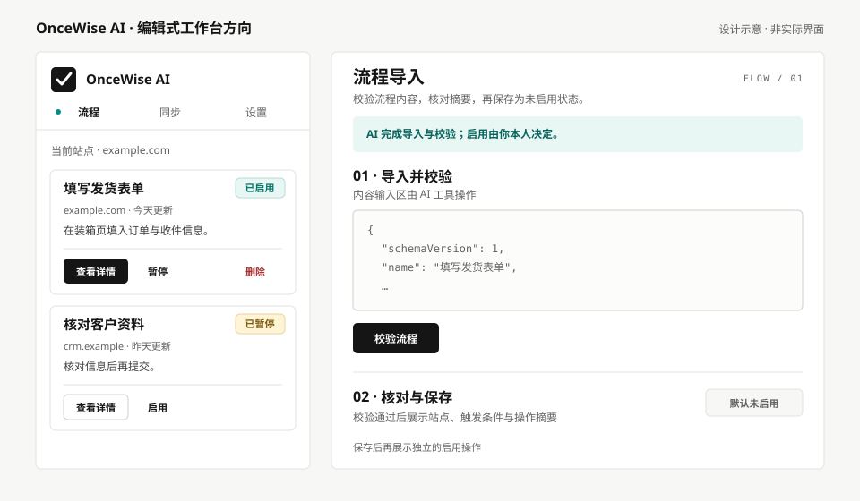

# OnceWise AI · 设计方向

## Overview

**状态：第一轮已应用。** 共享颜色、字体层级、卡片、按钮与状态标签已落在扩展页面；流程工作台和导入页完成了布局调整，图标也已换色。后续新增或修改 UI 时继续按本文约束；产品文案与业务约束仍以 `docs/` 中的需求、现有 i18n 和实际行为为准。

**一句话方向：借鉴 [Impeccable 网站](https://impeccable.style/)的编辑式工具界面，把流程状态和操作做得更鲜明。** 用户打开侧边栏，应能先认出当前站点和流程状态，再看流程做什么，最后找到可执行操作。导入页则要清楚区分 AI 完成的导入与校验、用户本人做的启用决定。

借鉴的是网站自身的近黑白底、细线、紧凑标签、明确主按钮和少量青绿色强调。首页示例中被批评的米色、斜体衬线字、卡片侧边彩条和过多状态胶囊，**不是**参考样式。网站的超大展示标题、滚动展示效果和黄色批注也不适合放进狭窄侧边栏。这里用平台系统字体实现相近的文字层级，不依赖网络字体。图标沿用原有图形，颜色已改为近黑与青绿。

### 先看样子

示意图用于讨论层级、密度和配色；它不是已实现页面，也不新增图中的示例流程。打开 SVG 可放大查看。直接打开 [Impeccable 首页](https://impeccable.style/)可对照原始视觉来源。

本文写法参考 [Impeccable 的 `document` 说明](https://impeccable.style/docs/document/)及其 [上下文文件约定](https://impeccable.style/docs/context/)，并参考公开的 [Neutral Modern `DESIGN.md`](https://github.com/nexu-io/open-design/blob/main/plugins/_official/design-systems/default/DESIGN.md)：数值集中在 frontmatter，正文解释使用条件。

## Colors

| 角色 | 色值 | 使用场景 |
| --- | --- | --- |
| Canvas / Surface | `#F7F7F5` / `#FFFFFF` | 中性页面底色 / 内容表面；保留轻微层次 |
| Ink / Muted | `#151515` / `#626262` | 流程名与主要说明 / 域名、时间和帮助文字 |
| Action | `#151515` | 每一区域最重要的实心操作；悬停变为 `#333333` |
| Accent | `#008F83` | 当前导航的小标记、焦点与少量引导性强调 |
| Success | `#08786F` | 已启用、完成；文案必须同时说明状态 |
| Warning | `#805D13` | 已暂停、需留意但可继续的情况 |
| Danger | `#A43232` | 执行失败、校验错误、删除操作 |
| Line | `#E2E2E0` | 分隔和卡片边框；不承担主要层级 |

大面积区域使用中性色。状态使用淡色背景、深色文字和明确标签；不依赖颜色单独表达“启用”“暂停”“失败”。青绿色只用于少量积极状态和焦点，避免满屏彩色徽章。导入页的“用户本人启用”边界提示应始终可见，但避免用整页警告色制造误报感。

## Typography

使用系统字体，中文随平台字体回退；JSON、流程 ID 和步骤编号可用 `ui-monospace, Consolas, monospace`。网站的大幅窄体字只作为层级参考，插件不用超大标题。侧边栏以 16px 的流程名、14px 正文、12px 元信息构成三级层级；导入页标题可到 20px。小型步骤标签可用较宽字距，但中文正文不加字距。长流程名、域名和错误详情必须允许换行，不截掉影响判断的信息。

## Layout

- **侧边栏优先：** 以 320–420px 宽度设计；页面内边距 16px，卡片间距 12px。窄于 360px 时操作按钮可换行，但状态标签和流程名都要完整可见。
- **流程卡片顺序：** 流程名与状态 → 站点和更新时间 → 一句话说明 → 最近失败（有才显示）→ 操作。常用操作比删除更显眼；删除保留清晰文字。用细线或留白分组，不用左侧彩条。
- **导入页：** 桌面宽度限制在约 860px。输入、校验结果、摘要与保存构成连续流程；保存后的启用是单独一步。流程列表与导入流程是两个独立区域。
- **节奏：** 使用 4/8/12/16/24/32px 间距阶梯。分组首先靠间距和标题；边框用于需要明确边界的卡片与输入框。

## Elevation & Depth

默认平面布局。卡片采用 1px 边框，不使用常态阴影；浮层如未来出现，再定义第二级阴影。页面层级主要由文字、留白和细线建立。

## Shapes

按钮、输入框和提示框采用 5px 圆角；独立卡片采用 6px。状态标签采用 4px 小圆角，保持“状态标记”而非装饰性胶囊的观感。图标只用于品牌和明确操作，不为普通列表项额外加彩色图标。

## Components

- **主按钮：** 近黑底白字，当前步骤只有一个。侧边栏最小高度 36px，导入页 38px；悬停、按下、禁用和键盘焦点必须可辨。
- **次按钮：** 白底、浅边框、深色字。删除按钮为危险态文字与边框，只有确认后的最终破坏性动作才使用实心危险色。
- **流程卡片：** 白色表面、浅边框；状态文字靠近流程名。操作区与说明区可用细分隔线分开。失败详情只在有失败时显示。
- **状态标签：** `Enabled` / `Paused` / `Draft` / `Failed` 各有文字和对应色；不同语言使用现有 i18n。草稿使用中性色，不给人已运行的错觉。
- **表单：** 标签和帮助文字不能只靠 placeholder。错误放在对应字段或结果旁，并保留可读的文字说明。JSON 输入保持等宽字体。
- **导航：** 当前页使用深色文字和细小青绿色标记；切换后焦点和内容标题应能说明当前位置。避免把整个导航按钮染成强调色。

## Do's and Don'ts

- 做：让用户在约三秒内看出“哪条流程已启用、作用于哪里、上次是否失败”。
- 做：清楚呈现“AI 导入和校验、用户启用”的操作边界；视觉优化不得改变这一业务约束。
- 做：验证英文和中文、长站点名、空列表、加载、失败、禁用以及窄侧边栏状态。
- 不做：照搬 Impeccable 的营销页布局、超大标题、黄色批注，或其首页“Before”反面案例中的米色与斜体衬线字。
- 不做：为了显得“AI”而使用渐变光效、脉冲点、玻璃拟态或大量彩色卡片。
- 不做：把危险操作只藏在图标里，或用颜色代替状态文字。
- 不做：新增页面时随意加入文档外的视觉流程；接入 Impeccable 后用 `document` 对照源码刷新记录和生成其元数据。
